# QuickBite

Professional Flutter food delivery app (internal name: QuickBite).

## Overview

QuickBite is a cross-platform Flutter application providing food discovery, ordering, and delivery features. The app is built with Flutter and integrates Firebase for backend services (authentication, Firestore, storage, messaging).

## Key features

- Browse restaurants and menus
- Authentication with Firebase
- Push notifications
- Image uploads and storage
- Maps and location features

## Screenshots

Below are a set of in-app screenshots. Click any image to view the full-size version.

| | | |
|---|---|---|
| 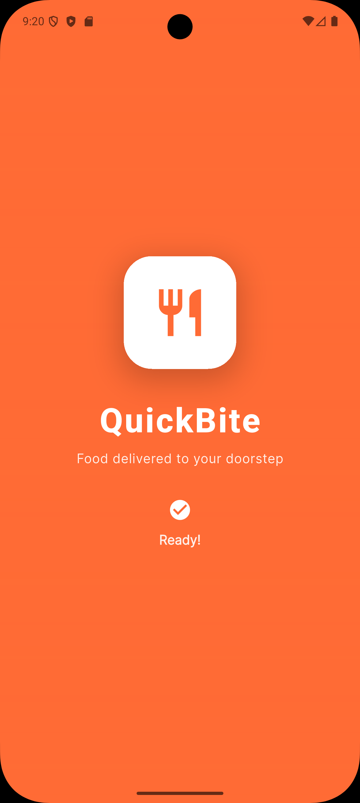 | 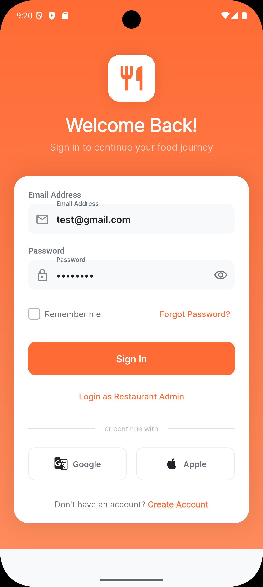 | 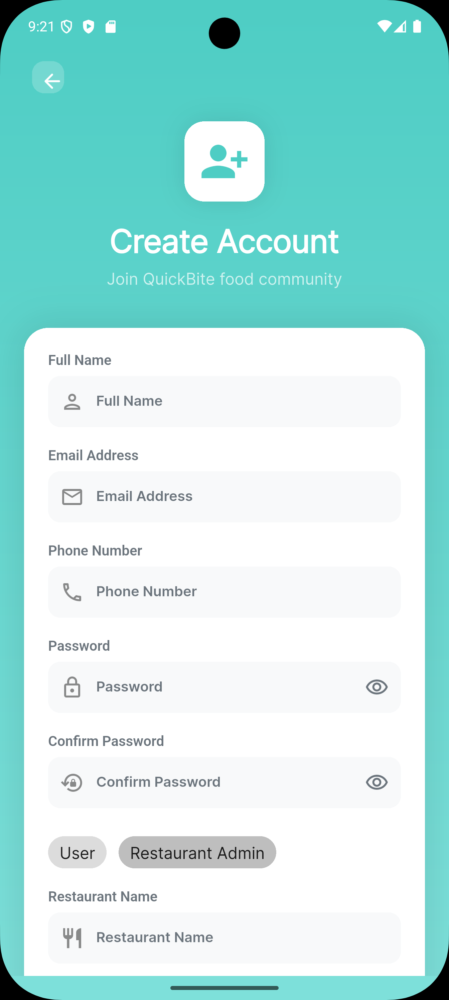 |
| 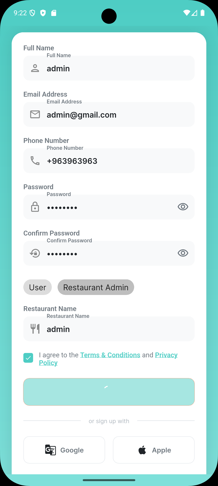 | 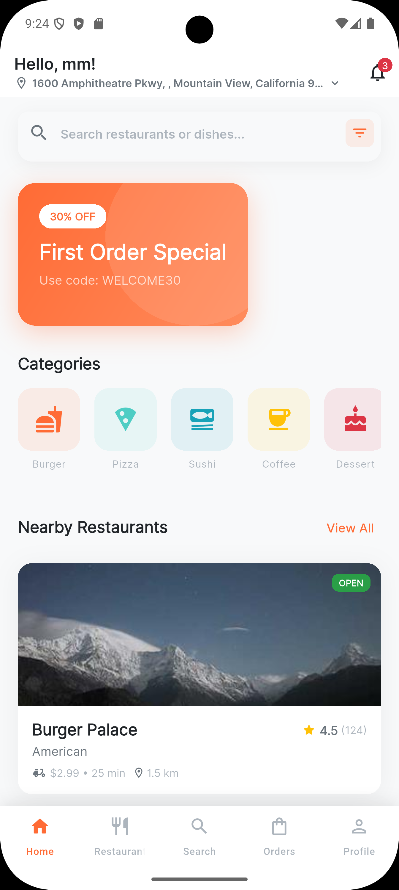 | 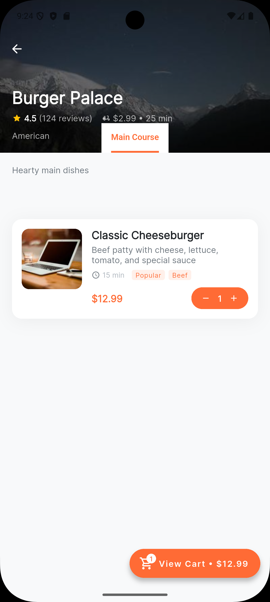 |
| 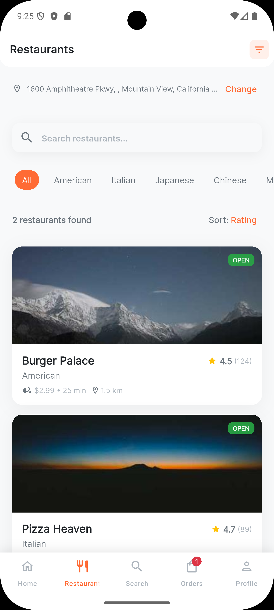 | 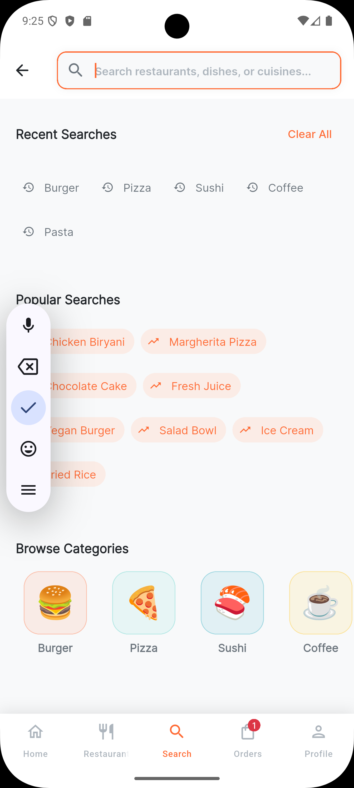 | 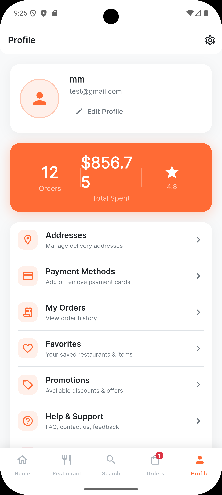 |
| 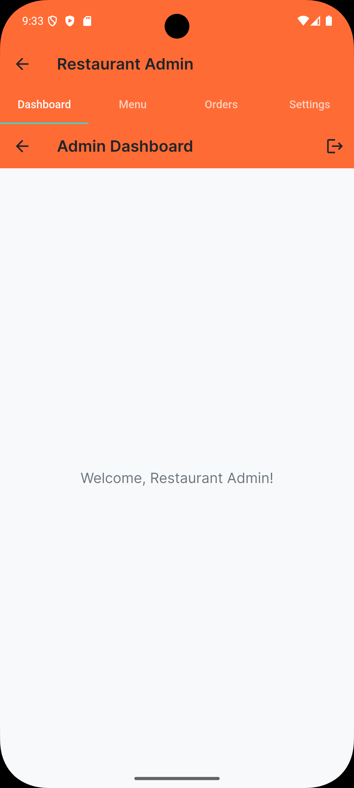 | 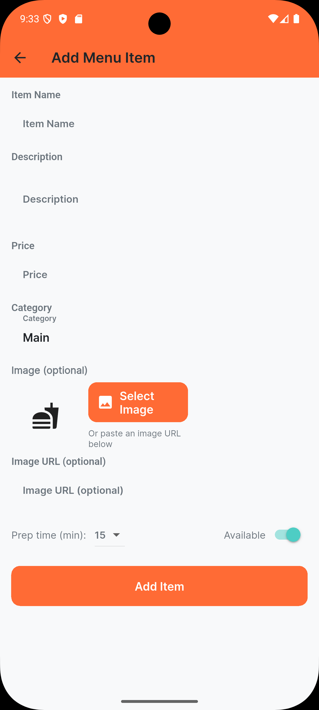 | 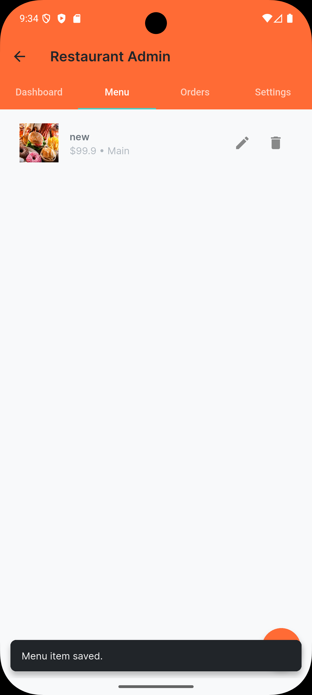 |
| 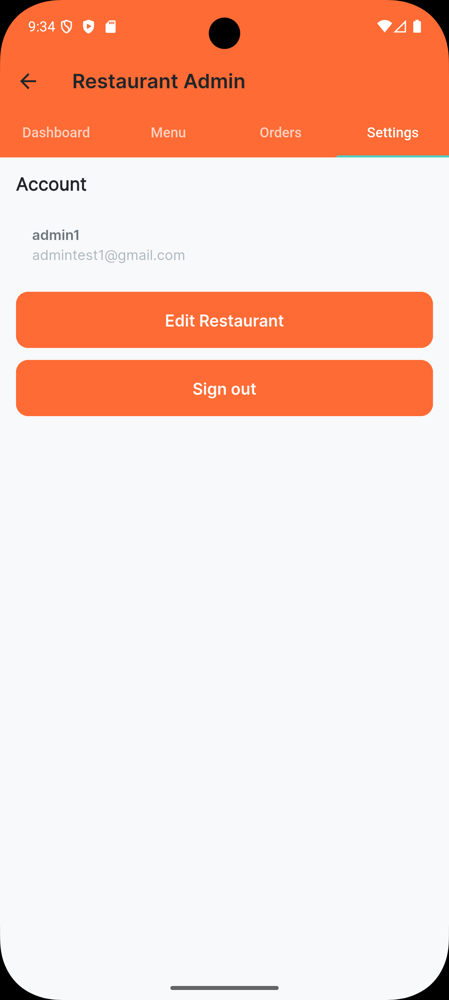 | 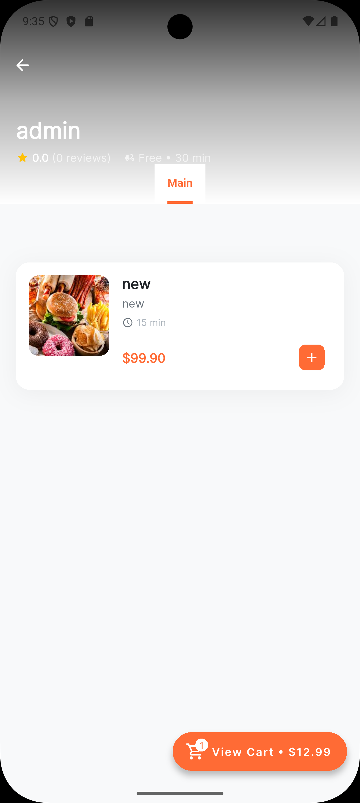 | |

If you want a different arrangement (larger thumbnails, captions, or fewer images), tell me which images to highlight.

## Prerequisites

- Flutter (stable channel) installed — see https://flutter.dev
- Dart SDK (bundled with Flutter)
- Android Studio / Xcode (for platform builds)
- Firebase project and config (this repo contains `lib/firebase_options.dart`)

## Quick start

1. Install dependencies:

```bash
flutter pub get
```

2. Configure Firebase (if not already):
- Create a Firebase project, add Android/iOS apps.
- Download and place the platform config files (`google-services.json` / `GoogleService-Info.plist`).
- Ensure `lib/firebase_options.dart` matches your Firebase config (this repo already contains a generated file).

3. Run on an emulator or device:

```bash
flutter run
```

4. Build release APK (Android):

```bash
flutter build apk --release
```

## Tests

Run widget tests:

```bash
flutter test
```


3. If your default branch is `master`, replace `main` with `master`.

## Contributing

Contributions are welcome. Open an issue or raise a PR with a clear description and tests where applicable.


